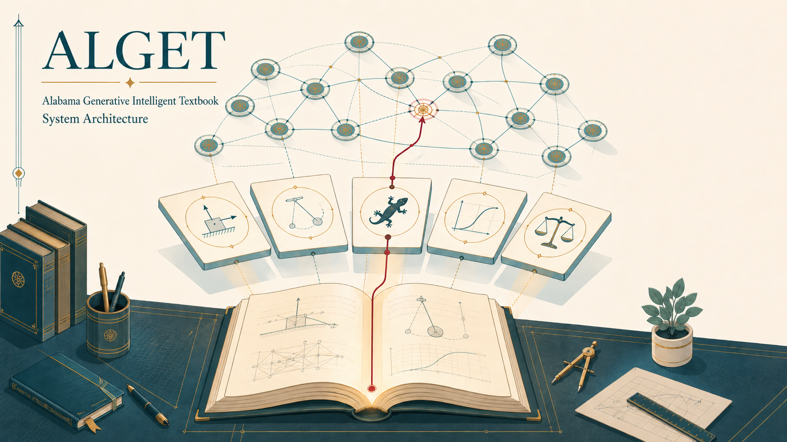
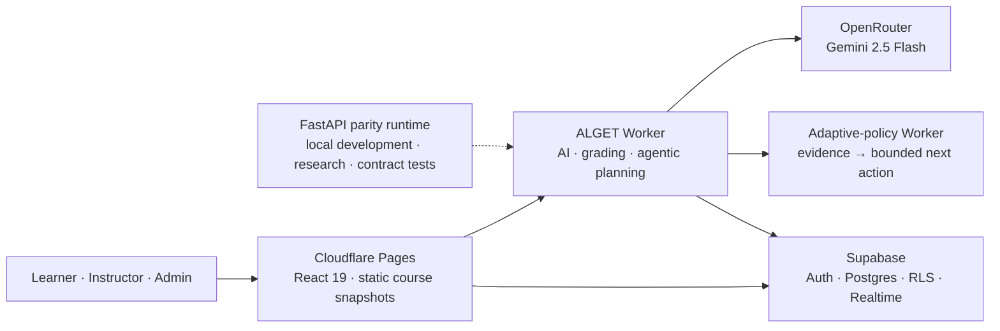
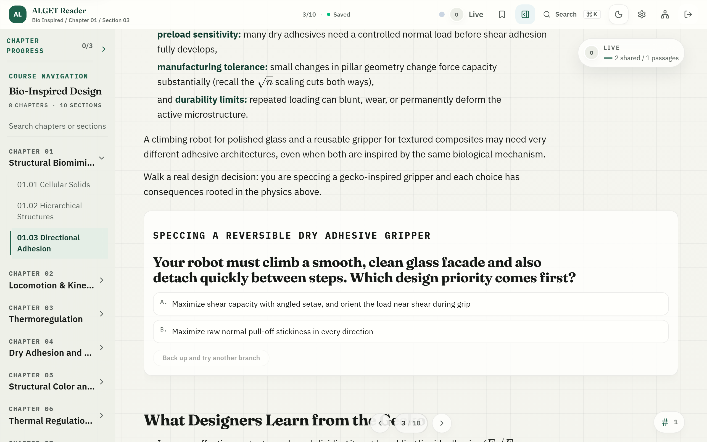
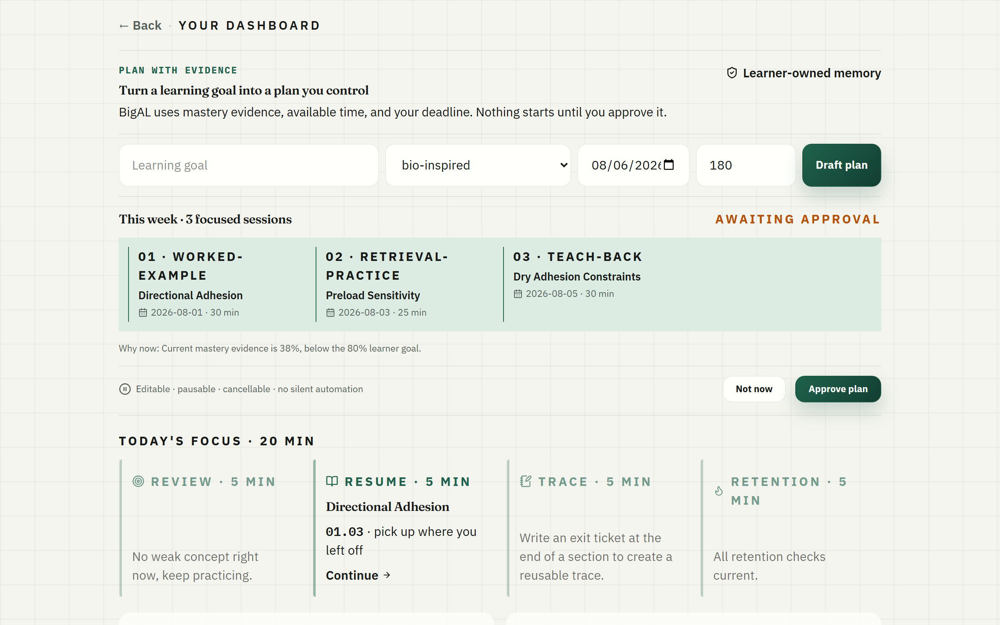
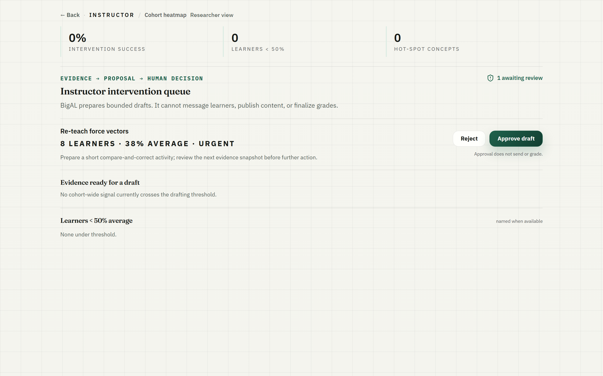
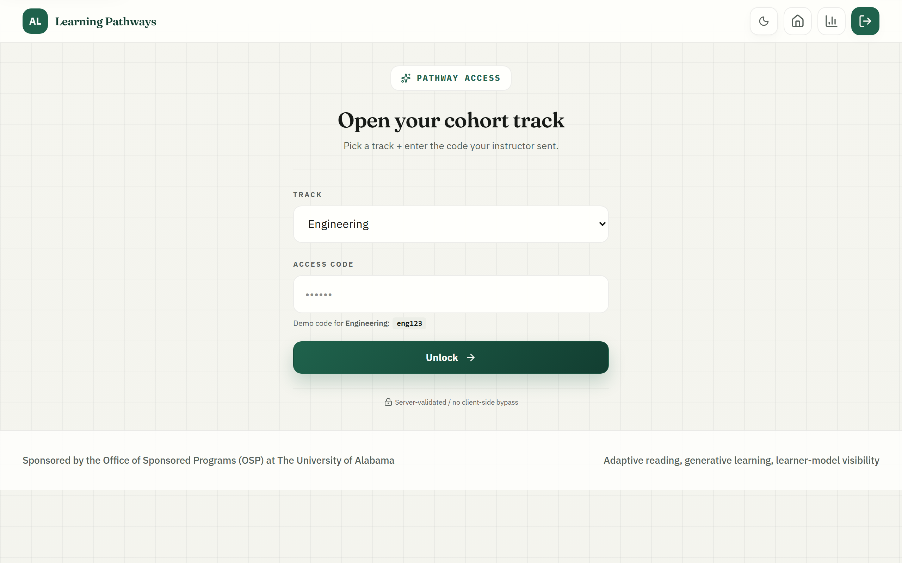
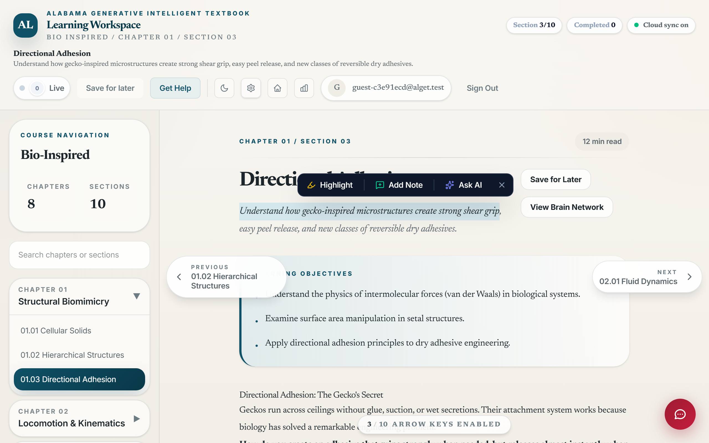
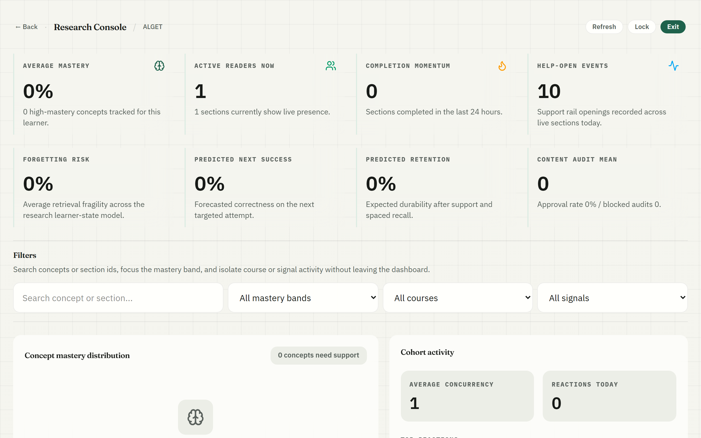
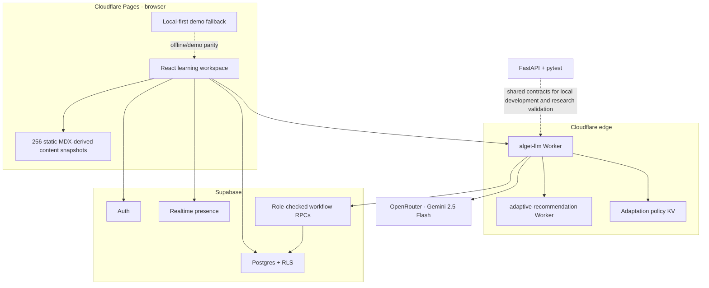
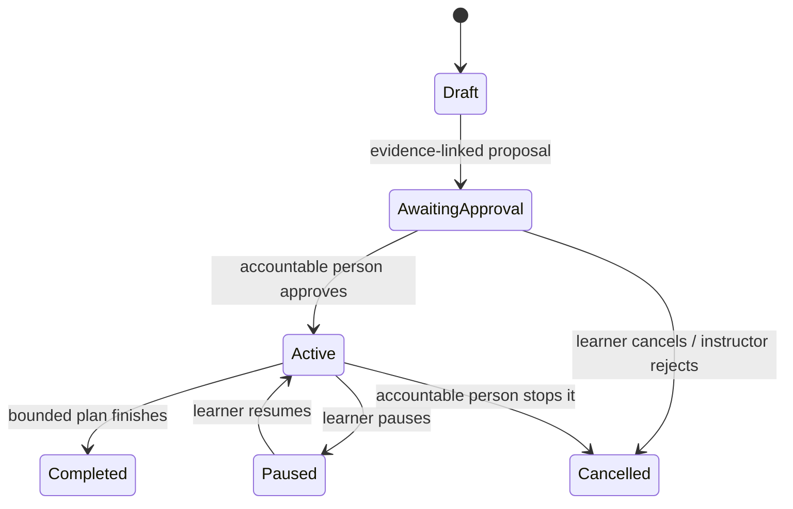

# ALGET — Alabama Generative Intelligent Textbook

> **A research-grade generative intelligent textbook (GIT) for university engineering and instructional-design education, built around a multi-agent tutoring architecture, Bayesian knowledge tracing, and a dual-panel Cognitive Walkthrough study design.**

<p align="center">
  
</p>
<p align="center"><em>A generative textbook where source-grounded content, learner evidence, and accountable human decisions remain connected.</em></p>

<p align="center">
  <a href="https://github.com/Educatian/alget/actions/workflows/ci.yml"></a>
  <a href="https://alget.pages.dev"></a>
  
  
</p>

<p align="center">
  <a href="https://alget.pages.dev"><strong>Live app</strong></a> ·
  <a href="#3-a-tour-of-the-surfaces"><strong>Product tour</strong></a> ·
  <a href="#4-architecture"><strong>Architecture</strong></a> ·
  <a href="docs/AGENTIC_LMS_RUNTIME.md"><strong>Agentic LMS contract</strong></a>
</p>

ALGET pairs canonical engineering and instructional-design content with a learning environment that responds to each learner — pace, confusions, strong concepts, weak ones — while staying grounded in source material through a debate loop of specialist agents and a peer-review validator. It is the reference implementation for the system paper currently being prepared (`paper_draft.md`).



---

## Table of contents

1. [What ALGET is](#1-what-alget-is)
2. [Eight courses](#2-eight-courses)
3. [A tour of the surfaces](#3-a-tour-of-the-surfaces)
4. [Architecture](#4-architecture)
5. [Multi-agent system](#5-multi-agent-system)
6. [Generative features](#6-generative-features)
7. [Knowledge tracing](#7-knowledge-tracing)
8. [Research design](#8-research-design)
9. [Quick start](#9-quick-start)
10. [Project structure](#10-project-structure)
11. [Documentation](#11-documentation)
12. [Deployment](#12-deployment)
13. [Tech stack](#13-tech-stack)
14. [Citation](#14-citation)
15. [License & acknowledgments](#15-license--acknowledgments)

---

## 1. What ALGET is

ALGET is **not a chatbot wrapped around a textbook**. It combines a versioned canonical course corpus with source-grounded explanations, practice, scenarios, and plans generated at the point of need. Every adaptive or agentic proposal is shaped by inspectable learning evidence and bounded by explicit learner, instructor, or administrator authority. Three commitments drive the design:

- **Learner variability is the design condition** (UDL). Multiple paths through the same idea are first-class.
- **Active retrieval, not passive reading.** Embedded checks, generated practice, and spaced retention are the load-bearing surfaces.
- **The tutor coaches; it never gives final answers.** Hard-gated by `prompts.py` constraints + the Validation Agent.

This repository contains: the running app, the content corpus, the multi-agent backend, the Supabase research-grade data model, the dual-panel Cognitive Walkthrough study artifacts, and the in-progress system paper.

---

## 2. Eight courses

| Course | Anchor textbook / framework | Sections |
|---|---|---|
| **Engineering Statics** | Hibbeler, *Engineering Mechanics: Statics* | 6 chapters / 14 sections |
| **Engineering Dynamics** | Beer, Johnston et al., *Vector Mechanics for Engineers* | 3 chapters / 11 sections |
| **Bio-Inspired Design** | Benyus's *Biomimicry*; Vincent, Bhushan | 8 chapters / 10 sections |
| **Foundations of Instructional Design** | Smith & Ragan; Gagné, Briggs & Wager; Reiser & Dempsey | 8 chapters / 17 sections |
| **AI & Ethics** | NIST AI RMF + EU AI Act crosswalk | 6 chapters / 12 sections |
| **AIL 606 Supplement** | Multimedia learning, LXD, AI-assisted authoring | 8 chapters / 64 sections |
| **CAT 531 Supplement** | Technology and teaching, policy, equity, evaluation | 8 chapters / 64 sections |
| **CAT 100 Supplement** | Digital citizenship, Excel, presentations, portfolios | 8 chapters / 64 sections |

All section narratives ship as MDX with sidecar JSON for stable learning objectives, misconceptions, and aligned practice items. The canonical corpus contains 256 sections; app catalog counts are generated from the same source files at build time.

```
frontend/content/<course>/<chapter>/<section>/
  ├── <section>.mdx                # narrative (custom MDX components: <inline-check>,
  │                                 #   <revealed-worked-example>, <remotion-clip>, …)
  ├── <section>.meta.json          # title, learning_objectives, concept_ids, time
  ├── <section>.misconceptions.json
  └── <section>.practice.json
```

---

## 3. A tour of the surfaces

Real screenshots captured from the current app via Playwright (1280×800 @ 2× DPR). Agentic examples are deterministic fixtures generated by `capture_screenshots.py`; they contain no learner records.

<table>
<tr>
<td width="33%" align="center">
  <a href="screenshots/03_book_reader.png"></a>
  <br><sub><b>Reading workspace</b> — <code>/book/&lt;course&gt;/&lt;ch&gt;/&lt;sec&gt;</code><br>source-grounded narrative · inline decisions · live presence</sub>
</td>
<td width="33%" align="center">
  <a href="screenshots/06_student_dashboard.png"></a>
  <br><sub><b>Learner-owned planner</b> — <code>/dashboard</code><br>mastery evidence → editable plan → explicit approval</sub>
</td>
<td width="33%" align="center">
  <a href="screenshots/07_instructor_dashboard.png"></a>
  <br><sub><b>Instructor intervention queue</b> — <code>/instructor</code><br>evidence → bounded proposal → human decision</sub>
</td>
</tr>
<tr>
<td width="33%" align="center">
  <a href="screenshots/02_course_chooser.png"></a>
  <br><sub><b>Course pathways</b> — <code>/learn</code><br>eight engineering and education pathways</sub>
</td>
<td width="33%" align="center">
  <a href="screenshots/09_highlight_popover.png"></a>
  <br><sub><b>Social annotation</b><br>Highlight · Add Note · Ask AI · evidence trace</sub>
</td>
<td width="33%" align="center">
  <a href="screenshots/08_analytics.png"></a>
  <br><sub><b>Research console</b> — <code>/analytics</code><br>RCT-grade telemetry · decision provenance · retention</sub>
</td>
</tr>
</table>

> Want a deeper walkthrough? See **[INSTRUCTOR_GUIDE.html](INSTRUCTOR_GUIDE.html)** (13 sections) and **[LEARNER_GUIDE.html](LEARNER_GUIDE.html)** (11 sections) — both ship with these same screenshots and editorial typography.

---

## 4. Architecture

### 4.1 Production topology



| Layer | Production responsibility | Failure boundary |
|---|---|---|
| **Cloudflare Pages** | SPA, fonts, diagrams, reference images, immutable course JSON | Core reading remains available without an AI response. |
| **ALGET Worker** | Tutor calls, deterministic grading, agentic plan proposals, admin/PDF APIs | Returns bounded fallbacks; it does not own learner authorization state. |
| **Adaptive Worker + KV** | Low-latency support selection and versioned course policy | Emergency pause suppresses interventions without blocking reading. |
| **Supabase** | Identity, RLS-governed records, Realtime, workflow events and reviewed RPCs | Tables are read-only to clients where approval integrity matters. |
| **FastAPI parity runtime** | Local development, research experiments, Python contract tests | Not required for the Cloudflare production reading path. |

### 4.2 Dynamic API surface (Worker + FastAPI parity)


| Route | Method | Role |
|---|---|---|
| `/api/orchestrate` | POST | **Single entry point for all learning requests.** Intent-classifies and routes through the agent pipeline. |
| `/api/generate` | POST | Module content generation (narrative / activity / simulation / illustration) |
| `/api/grade` | POST | BKT-driven mastery update |
| `/api/mastery_graph` | POST | Concept DAG with `p_known` per node |
| `/api/adaptive_recommendation` | POST | Next-action policy (explain / represent / practice / ask / advance) |
| `/api/practice/generate` | POST | On-demand generated practice item |
| `/api/explain` | POST | On-demand generated explanation |
| `/api/book/{course}/toc` | GET | Course TOC |
| `/api/diagnostic/questions/{course_id}` | GET | Pre-test items |
| `/api/access/validate` | POST | Scope-gated unlock (engineering / education / researcher) |
| `/api/agentic/tools` | GET | Governed tool registry with risk and approval requirements |
| `/api/agentic/tools/evaluate` | POST | Default-deny permission and execution policy check |
| `/api/agentic/workflows/transition-check` | POST | Validate a workflow state transition before persistence |
| `/api/agentic/learner-plan` | POST | Draft an evidence-linked, learner-approved study plan |
| `/api/agentic/interventions/propose` | POST | Draft a bounded instructor intervention; never sends or grades |
| `/api/chat`, `/api/log-events` | POST | BigAL chat + telemetry beacon |

### 4.3 Frontend routes (React Router 7)

| Route | Component | Gate |
|---|---|---|
| `/` | LandingPage | public |
| `/learn` | MainApp (course chooser, progress) | user |
| `/diagnostic/:course` | DiagnosticAssessment | user |
| `/book/:course` | BookLayout (TOC) | user |
| `/book/:course/:chapter/:section` | BookLayout (reader + IntelRail + ChatWidget) | user |
| `/dashboard` | StudentDashboard + learner-owned study planner | user |
| `/instructor` | InstructorDashboard + intervention approval queue | `alget_instructor_access` |
| `/admin` | AdminControlPlane (ingestion, agents, policy, audit) | admin / course admin |
| `/lab` | GenerativeLab (CurriculumAgent module gen) | researcher |
| `/analytics` | AnalyticsDashboard (research console) | researcher |

### 4.4 Data and approval model

Six SQL schemas, all RLS-gated:

- `supabase_schema.sql` — users, courses, sections, concepts, assessment_items, misconceptions
- `supabase_research_schema.sql` — **the research backbone**: `learner_concept_state`, canonical `interaction_events`, `recommendation_decisions`, `intervention_traces`, `evaluation_runs(phase=pre/post/retention)`, item-level `evaluation_responses`, `experiment_assignments`, `model_registry`, `content_audits`, `human_ratings`
- `supabase_learning_features.sql` — course_progress, bookmarks, practice_history
- `supabase_logging.sql` — event_logging, user_sessions, grading_log
- `supabase_social_features.sql` — social_presence, collaboration_groups, highlight_reactions, highlight_replies, kindred-readers view
- `supabase_all_in_one.sql` — single bundled deploy file

The timestamped migration `supabase/migrations/20260730100000_agentic_lms_runtime.sql` adds durable workflows, workflow events, learner goals/plans, and instructor intervention review queues. Proposals are separated from effects: learner plans and instructor interventions remain `awaiting_approval` until the accountable person acts. Messaging, publishing, enrollment changes, and final-grade execution are not exposed as autonomous actions. See `docs/AGENTIC_LMS_RUNTIME.md`.

The four-way join `experiment_assignments × interaction_events × intervention_traces/recommendation_decisions × evaluation_runs/evaluation_responses` is what makes RCT, off-policy evaluation, item diagnostics, and forgetting-rate estimation tractable directly from production data.

### 4.5 Agentic workflow lifecycle



Every transition writes an `agent_workflow_events` record. Approval changes workflow state only: autonomous messaging, publishing, enrollment changes, and final-grade execution remain unavailable by policy.

---

## 5. Multi-agent system

15 specialist agents live in `backend/agents/`. The **OrchestratorAgent** classifies intent and routes through the relevant subset.

| Agent | Role | When invoked |
|---|---|---|
| **OrchestratorAgent** | Intent classification + routing | every request |
| **BiologyAgent** | Mechanism extraction (organism, key terms) | learn / brainstorm / illustrate |
| **EngineeringAgent** | Biology → engineering translation; supports `revise()` | after Biology |
| **ValidationAgent** | Internal **peer review** (1–10, biological_fidelity, engineering_feasibility) | after Engineering |
| **TutorAgent** | Synthesis + encouragement + next steps | end of `learn` |
| **EvaluatorAgent** | Janine-Benyus persona for design critique | `evaluate` intent |
| **ActivityAgent** | Lateral-thinking prompts | `brainstorm` |
| **SimulationAgent** | HTML/p5.js interactive sketch | `simulate` |
| **IllustrationAgent** | Image prompt + UI annotation | `illustrate` |
| **ScaffoldingAgent** | Socratic hints | `help` |
| **AssessmentAgent** | Quiz / exam generation | `/api/generate_assessment` |
| **CurriculumAgent** | Whole-module generation | `/lab` (gated) |
| **PracticeGenerationAgent** | On-demand micro-problem | rail Practice tab |
| **ExplanationAgent** | On-demand fresh explanation | rail Explain tab |
| **CritiqueAgent** | Reviews generative output before learner sees it | every generative call |

### Debate loop (bio-inspired)

```
Biology → Engineering(v1) → Validation
                              │
                              ▼ (score < 7 or invalid)
                        Engineering.revise(critique)
                              │
                              ▼
                        Validation re-score
                        (≤ 2 revision rounds)
```

This loop is the system's **academic differentiator**: the textbook *disagrees with itself* before answering the learner, mitigating single-call hallucination at the cost of two extra inferences per request. Per-agent temperatures and JSON-mime-type response gating live in `backend/prompts.py` and `backend/agents/config.py`.

Pydantic schema gates (`backend/agents/schema_gate.py`) validate every agent output; failures surface as deterministic fallbacks rather than caller-side parse errors.

---

## 6. Generative features

ALGET is *generative*, not just *adaptive*. Five learner-facing generative surfaces:

1. **Explain / Reframe** (rail). Fresh, section-context-grounded re-expression composed at the moment you ask.
2. **Practice** (rail). PracticeGenerationAgent picks the weakest subskill and writes a targeted micro-problem; CritiqueAgent reviews before delivery.
3. **Simulate / Illustrate** (chat). SimulationAgent emits a self-contained HTML/p5.js sketch; bio-inspired runs through ValidationAgent first.
4. **Multi-agent grounded answers** (chat). Bio-inspired routes through Biology → Engineering → Validation → Tutor with the debate loop above.
5. **Generative Lab** at `/lab` (researcher / instructor). CurriculumAgent generates a complete new module (narrative + practice + misconceptions) from a biology + engineering context.

Learner-facing generations now carry the additive
[`generation-trace-v1`](docs/GENERATION_TRACE.md) contract: model and prompt
versions, output hash, content version, attached context, review status, and an
explicit statement that attached context is not yet claim-level citation
verification. Privacy-safe trace metadata is also written to the event log.

A pilot Remotion-rendered video clip — **Directional Adhesion: How Geckos Stick** — is live in `bio-inspired/01/03` via `@remotion/player`'s `<Player>` (see `frontend/src/animations/bio_inspired/DirectionalAdhesion.jsx` + `frontend/src/components/RemotionClip.jsx`).

---

## 7. Knowledge tracing

`backend/knowledge_tracing.py` (~120 lines):

- **Bayesian Knowledge Tracing** (`update_p_known(p_known, is_correct)` Bayes update with `p_guess=0.2`, `p_slip=0.1`, `p_transit=0.1`).
- **Q-Matrix** mapping items to concepts with weights — one item updates multiple concepts proportionally; preserves interpretability over DKT-class methods.
- **Telemetry fusion** (`apply_telemetry_fusion`): chat engagement, hint requests, simulation play, and affect signals (confused / insight / engaged / disengaged) bend `p_slip` and `p_transit` in calibrated directions.

Mastery is mirrored from in-memory state into `learner_concept_state(mastery_prob, μ, σ, forgetting_half_life, transfer_readiness, calibration_error, dominant_misconception)` on every grade call so the research backbone tables remain authoritative.

---

## 8. Research design

ALGET is also a **research instrument**.

### 8.1 Dual-panel Cognitive Walkthrough

`CW_Research/` and `CW_Research_BioEngineering/` are parallel between-subjects evaluations:

- **Panel A (CW_Research/)**: instructional-design / education SMEs. Wharton et al. 1994 classic CW + Benson & Ssemugabi 2007 e-learning add-ons. Severity 0–4. Phase 1 independent ratings → Phase 2 consolidation discussion (Δ ≥ 2). Priority = AvgSeverity × #Flagged.
- **Panel B (CW_Research_BioEngineering/)**: mechanical-engineering / biomimicry SMEs. Same protocol, domain-specific tasks.

This dual structure separates **pedagogical validity** from **domain rigor** — a system can pass one and fail the other.

### 8.2 RCT-grade telemetry

The Supabase research views (`rct_intervention_outcomes`, `rct_evaluation_gains`, `rct_user_telemetry_profile`, `rct_evaluation_item_diagnostics`) join interventions, decisions, canonical interaction events, and pre/post/retention item responses so off-policy evaluation, learning-gain causal inference, item diagnostics, and forgetting-rate estimation are direct SQL.

### 8.3 System paper

`paper_draft.md` (in progress). Frames the **Tripartite Research Problem** — biomimicry epistemology × multi-agent pedagogy × intelligent textbook — and reports the dual-panel CW results.

---

## 9. Quick start

### 9.1 Prerequisites

- Python 3.11+
- Node 20+ (or 22)
- A Gemini API key (`GOOGLE_API_KEY` or `GEMINI_API_KEY`)
- A Supabase project URL + anon key (or run in offline / demo mode)

### 9.2 Backend

```bash
cd backend
python -m venv .venv && source .venv/Scripts/activate  # Windows
pip install -r ../requirements.txt
export GEMINI_API_KEY=your_key_here  # or set in backend/.env
python -m uvicorn server:app --host 127.0.0.1 --port 8000 --reload
```

API at `http://127.0.0.1:8000/api/...`. Contract tests:

```bash
cd backend && python -m pytest test_orchestrate_contract.py test_e2e_orchestrate.py
```

### 9.3 Frontend

```bash
cd frontend
npm install
npm run dev          # http://127.0.0.1:5173
npm run lint         # ESLint sweep
npm run build        # Vite build
```

`frontend/.env.local`:

```
VITE_SUPABASE_URL=https://your-project.supabase.co
VITE_SUPABASE_ANON_KEY=eyJ...
VITE_API_BASE=http://127.0.0.1:8000/api    # only needed if the Vite proxy is not used
```

If Supabase env vars are absent, the app runs in **offline / demo mode** (a stub user; no persistence). See `frontend/src/lib/supabase.js`.

### 9.4 Database

In Supabase SQL Editor, run files in order:

```
backend/supabase_schema.sql
backend/supabase_logging.sql
backend/supabase_learning_features.sql
backend/supabase_research_schema.sql
backend/supabase_social_features.sql
supabase/migrations/20260730090000_admin_control_plane.sql
supabase/migrations/20260730100000_agentic_lms_runtime.sql
```

The timestamped migrations add the administrative and agentic runtime layers and must be applied after the legacy schema bundle. Every new table is RLS-gated; security-definer RPCs perform identity and role checks before creating or reviewing workflows.

### 9.5 Demo flow

1. Open `http://127.0.0.1:5173/` → click **Sign in to start** → **Continue in Demo Mode**.
2. Pick a course at `/learn` (use the access code your instructor shares, or configure `INSTRUCTOR_ACCESS_CODE` etc. in backend env vars for local development).
3. Take the diagnostic, then walk a section.

### 9.6 Capture screenshots (for guides)

```bash
pip install playwright && python -m playwright install chromium
python capture_screenshots.py   # 8 surface PNGs into screenshots/
python capture_highlight.py     # selection popover via Range API
python swap_screenshots.py      # rewrite SVG mockups →  in *.html
```

---

## 10. Project structure

```
alget/
├── README.md                          ← you are here
├── INSTRUCTOR_GUIDE.html / .md        ← full instructor handbook (HTML + Markdown)
├── LEARNER_GUIDE.html / .md           ← learner handbook
├── USER_GUIDE.md                      ← short-form Socratic-method usage guide
├── CONTENT_GUIDE.md                   ← content authoring guide (Korean)
├── DEPLOYMENT_ENV.md                  ← env-var reference
├── LITERATURE_REVIEW.md               ← framing for the system paper
├── paper_draft.md                     ← system paper (in progress)
├── system_conversation_log.md         ← bottom-up dependency analysis log
├── ui_design_recommendations.md       ← design-system rationale (Korean)
├── REMOTION_ANIMATION_MAP.md          ← per-section Remotion priority map
├── NOTEBOOKLM_REMOTION_INTEGRATION.md ← audio + video pipeline architecture
├── render.yaml                        ← Render backend deploy spec
├── vercel.json                        ← Vercel frontend deploy spec
├── requirements.txt                   ← Python deps
│
├── backend/
│   ├── server.py                      ← FastAPI entry point
│   ├── prompts.py                     ← system prompts (Mayer multimedia principles)
│   ├── knowledge_tracing.py           ← BKT + Q-Matrix + telemetry fusion
│   ├── grading_service.py             ← numeric / units / equilibrium solver
│   ├── rag_service.py                 ← Gemini embeddings + cosine retrieval
│   ├── content_service.py             ← MDX corpus indexer
│   ├── content_audit.py + report.md   ← coverage audit pipeline
│   ├── content_priority_plan.md       ← Tier 1–4 content roadmap
│   ├── engineering_text_fidelity_rubric.md  ← 6-dim scoring rubric
│   ├── inst_design_benchmark.md       ← cross-course quality comparison
│   ├── SYSTEM_DESIGN_HISTORY.md       ← 5-stage system evolution log
│   ├── agents/
│   │   ├── orchestrator.py            ← intent routing + debate loop
│   │   ├── biology_agent.py / engineering_agent.py / validation_agent.py
│   │   ├── tutor_agent.py / evaluator_agent.py
│   │   ├── practice_generation_agent.py / explanation_agent.py / critique_agent.py
│   │   ├── activity_agent.py / scaffolding_agent.py
│   │   ├── simulation_agent.py / illustration_agent.py
│   │   ├── assessment_agent.py / curriculum_agent.py
│   │   ├── schema_gate.py             ← Pydantic gates with deterministic fallback
│   │   └── config.py                  ← per-agent temperature + token caps
│   ├── supabase_*.sql                 ← 6 SQL schemas (RLS-gated)
│   └── test_orchestrate_contract.py + test_e2e_orchestrate.py
│
├── frontend/
│   ├── package.json                   ← React 19.2 + Vite 7.2 + Tailwind v4
│   ├── vite.config.js                 ← markdown-stack chunking
│   ├── src/
│   │   ├── App.jsx                    ← <ThemeProvider><ToastProvider><Router>
│   │   ├── pages/                     ← LandingPage, MainApp, BookLayout,
│   │   │                              ←   StudentDashboard, InstructorDashboard,
│   │   │                              ←   AnalyticsDashboard, GenerativeLab, …
│   │   ├── components/
│   │   │   ├── IntelRail.jsx          ← Explain / Reframe / Practice / Ask
│   │   │   ├── ChatWidget.jsx         ← BigAL floating tutor
│   │   │   ├── HighlightableContent.jsx + HighlightDiscussion.jsx
│   │   │   ├── KnowledgeGraph.jsx     ← brain-network mastery viz
│   │   │   ├── PracticeBlock.jsx + KnowledgeCheck.jsx + InlineCheck.jsx
│   │   │   ├── RevealedWorkedExample.jsx
│   │   │   ├── ConceptDiagrams.jsx + CourseIllustrations.jsx
│   │   │   ├── RemotionClip.jsx       ← @remotion/player wrapper
│   │   │   ├── Skeleton.jsx           ← shared loading primitives
│   │   │   ├── ThemeToggle.jsx        ← dark mode toggle
│   │   │   ├── OnboardingTour.jsx     ← 5-step first-visit tour
│   │   │   └── …
│   │   ├── animations/
│   │   │   ├── registry.js            ← Remotion clip registry
│   │   │   └── bio_inspired/DirectionalAdhesion.jsx ← pilot composition
│   │   ├── hooks/
│   │   │   ├── useTextSelection.js    ← highlight + note hook
│   │   │   ├── useSocialPresence.js   ← Supabase Realtime presence
│   │   │   └── useCourseProgress.js
│   │   └── lib/
│   │       ├── researchService.js     ← snapshot / trace / replay
│   │       ├── knowledgeService.js    ← mastery + adaptive signals
│   │       ├── loggingService.js      ← 5-second buffered telemetry
│   │       ├── socialService.js       ← presence + identity + signals
│   │       ├── toast.jsx + toastContext.js
│   │       ├── theme.jsx + themeContext.js
│   │       ├── apiConfig.js + supabase.js + demoUser.js
│   │       └── onboarding.js
│   └── content/<course>/<chapter>/<section>/{section}.{mdx,meta.json,…}
│
├── CW_Research/                       ← Cognitive Walkthrough — education panel
├── CW_Research_BioEngineering/        ← Cognitive Walkthrough — engineering panel
├── reading/                           ← AIED 2025 literature library (PDFs)
│
├── screenshots/                       ← Playwright captures used by the HTML guides
├── capture_screenshots.py             ← guide-screenshot pipeline
├── capture_highlight.py               ← selection popover capture
└── swap_screenshots.py                ← SVG mockup →  rewriter
```

---

## 11. Documentation

| Document | Audience | What it covers |
|---|---|---|
| **`INSTRUCTOR_GUIDE.html`** ([md](INSTRUCTOR_GUIDE.md)) | instructors | 13 sections — surfaces, dashboard reading, intervention heuristics, FERPA / COPPA / IDEA, content-defect workflow, two-week class ramp |
| **`LEARNER_GUIDE.html`** ([md](LEARNER_GUIDE.md)) | learners | 11 sections — six learning habits, IntelRail, BigAL, retention, generative features, privacy, FAQ |
| `USER_GUIDE.md` | both | short-form: Socratic method, Life's Principles 5, FBD norms |
| `CONTENT_GUIDE.md` | authors | UA 1–2nd-year ME curriculum mapping (Korean) |
| `DEPLOYMENT_ENV.md` | operators | env vars + access codes |
| `LITERATURE_REVIEW.md` | researchers | da Vinci → Benyus, Piaget / Vygotsky, Bloom 2-σ |
| `paper_draft.md` | researchers | system paper in progress |
| `backend/SYSTEM_DESIGN_HISTORY.md` | maintainers | 5-stage evolution narrative |
| `backend/agents/MULTI_AGENT_GENERATIVE_DESIGN.md` | maintainers | per-agent contract + debate-loop spec |
| `docs/AGENTIC_LMS_RUNTIME.md` | maintainers / reviewers | workflow states, permission policy, human approval boundaries, deployment checks |
| `backend/engineering_text_fidelity_rubric.md` | content authors | 6-dim scoring rubric (concept clarity, quantitative rigor, eng-translation, constraint awareness, learner support, voice) |
| `backend/content_audit_report.md` + `content_priority_plan.md` | content authors | gap audit (42 sections, severity 0) + Tier 1–4 plan |
| `REMOTION_ANIMATION_MAP.md` + `NOTEBOOKLM_REMOTION_INTEGRATION.md` | maintainers | per-section animation priority + audio/video pipeline |
| `CW_Research/01_Methodology_Validation.md` | researchers | dual-panel CW protocol |

---

## 12. Deployment

### 12.1 Frontend and static content — Cloudflare Pages

The Vite production build publishes the React SPA, security headers, SPA fallback, course snapshots, reference images, and fonts to `https://alget.pages.dev`. Reading does not wait for a model or a Python server.

### 12.2 Dynamic compute — Cloudflare Workers

`cloudflare/llm-proxy` serves tutor, grading, research-validation, admin/PDF, and governed agentic-planning endpoints at `https://alget-llm.jewoong-moon.workers.dev`. The adaptive recommendation policy runs in a second Worker through a service binding; policy versions and emergency controls use KV.

### 12.3 Identity and durable state — Supabase

Supabase provides Auth, PostgreSQL, Realtime, and reviewed workflow RPCs. RLS is enabled on every application table. Agentic workflow tables expose read-only client grants; state changes occur through role-checked RPCs that append audit events.

### 12.4 Release order

Apply reviewed forward migrations first, then deploy Workers before Pages. The blocking gate is `node scripts/release_readiness.mjs`; the operational sequence and rollback evidence are defined in [`RELEASE_RUNBOOK.md`](RELEASE_RUNBOOK.md).

---

## 13. Tech stack

**Frontend** — React 19.2 · React Router 7.11 · Vite 7.2 · Tailwind v4 (`@tailwindcss/vite`) · `react-markdown 10.1` + `remark-math` + `rehype-katex` + KaTeX 0.16 · `@supabase/supabase-js 2.89` · Radix UI (popover, tooltip) · `lucide-react` · `@remotion/player` 4.0 · Vitest 3.2 + Testing Library + jsdom.

**Edge runtime** — Cloudflare Workers · Wrangler 4 · service bindings · KV · OpenRouter API · `unpdf`.

**Python parity/runtime research** — Python 3.11 · FastAPI · Pydantic v2 · Uvicorn · 15 specialist-agent modules · pytest 9.

**Data** — Supabase (PostgreSQL 13, Realtime, RLS).

**LLM** — Gemini 2.5 Flash through OpenRouter in production. Structured outputs, bounded prompts, deterministic policy checks, and human approval gates constrain model-generated proposals.

---

## 14. Citation

```bibtex
@misc{alget2026,
  title  = {ALGET: A Generative Multi-Agent Architecture for Bio-Inspired Engineering Education},
  author = {Educatian},
  year   = {2026},
  note   = {System paper in progress; see paper\_draft.md.},
  url    = {https://github.com/Educatian/alget}
}
```

---

## 15. License & acknowledgments

License: see `LICENSE` (TBD; current default treatment is research / non-commercial use until the system paper is published).

ALGET draws on the work of: **Janine Benyus** (biomimicry), **Mayer** (cognitive theory of multimedia learning), **Roediger & Karpicke** (testing effect), **Cepeda et al.** (spacing effect), **Bjork & Bjork** (desirable difficulties), **Smith & Ragan / Gagné** (instructional design), **CAST** (UDL), **Reiser & Dempsey** (instructional-design canon), **Hibbeler / Beer / Vincent / Bhushan** (engineering and bio-inspired source texts). The dual-panel Cognitive Walkthrough method follows **Wharton et al. 1994** with **Benson & Ssemugabi 2007** e-learning extensions.

The system reuses the **University of Alabama** "Big Al" mascot lineage as the BigAL tutor persona. The **Janine** evaluator persona is named in honor of Benyus's foundational *Biomimicry* (1997).

> Good teaching uses tools. ALGET is a tool. Your judgment is still the teaching.
