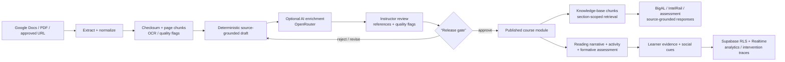

# ALGET source-to-textbook architecture

Updated 2026-09-06 for commit `8f350f8`.

This is the current contract for turning an instructor's source into a learner-visible intelligent textbook module. The important boundary is deliberate: extraction and generation can be automated; release is always an accountable human decision.

## Stages and owners

| Stage | Runtime | Output | Release boundary |
|---|---|---|---|
| Source intake | Cloudflare Worker `/faculty/google-docs/import` or `/faculty/pdf/import`; FastAPI parity routes | Canonical source metadata, page-addressable text, SHA-256 checksum, heading candidates | Authenticated instructor/course admin only |
| Normalization | `backend/admin_control.py` and Worker parity helpers | Clean excerpts, section IDs, source locators, references | Front matter, page numbers, and reference-list noise are removed before drafting |
| Draft assembly | Deterministic source-grounded builder | Reading prose, learning objectives, concept IDs, activity, simulation proposal, tutor config, analytics contract, social rules, knowledge-base chunks, and formative problems | `student_visible=false`, `automatic_publish=false` |
| Enrichment | Optional OpenRouter call | Revised draft with the same schema; fallback keeps the deterministic draft | AI output is still a shadow draft and is never auto-published |
| Review | Faculty partnership workspace | Quality flags, references, source evidence, instructor edits, approval status | Missing reading/KB/practice or unresolved quality flags block readiness |
| Publish | `facultyPartnershipService.publishFacultyPilot` + RLS-protected `published_course_modules` | Learner reader section under “Instructor-published modules” | Requires explicit instructor/course-admin approval |
| Runtime retrieval | `BookLayout` → `IntelRail` / `ChatWidget` → Worker or FastAPI | Up to five section-scoped source chunks attached to each tutor/explain/represent/assessment request | Retrieval never crosses the published section scope |

## Current contracts

- **Reading:** each generated section has learner-facing prose, a purpose, and an estimated reading time.
- **Knowledge base:** `knowledge_base.chunks[]` carries `id`, `text`, `source_id`, and section metadata; `nodes[]` carries concept IDs and evidence excerpts.
- **Formative assessment:** `practice.problems[]` includes a multiple-choice check and a teach-back prompt, each with source evidence and concept IDs.
- **Tutor:** generated tutor settings identify the BigAL persona, Socratic boundary, evidence rule, and `published-section-only` scope.
- **Analytics/social:** activity and simulation evidence fields, peer-pulse rules, and an analytics event contract are generated beside the lesson so support can be audited rather than inferred from clicks.
- **Traceability:** source hash, content version, generation trace, approval actor, and publish timestamp travel with the module record.

## Failure boundaries

1. If extraction fails, the source stays in an ingestion error state and no draft is created.
2. If AI enrichment fails, the deterministic source-grounded draft remains reviewable; the UI shows the warning.
3. If Supabase is unavailable, the faculty workspace reports the persistence boundary and only uses the explicitly configured local/demo store; learner records are not silently copied to browser storage.
4. If the release gate fails, the module remains private and no reader route is added.
5. If retrieval is empty at runtime, BigAL returns an evidence-labelled scaffold and does not invent a source claim.

## Verification checklist

- `py scripts/validate_content.py` — canonical corpus and section metadata.
- `py scripts/content_audit.py` and `py backend/content_quality_audit.py` — coverage, readability, and boilerplate checks.
- `node --test cloudflare/llm-proxy/src/*.test.mjs` — Worker parity and faculty import contracts.
- `py -m pytest` — FastAPI/admin/content contract tests.
- `npm test -- --run`, `npm run lint`, and `npm run build` — frontend behavior and production bundle.
- `screenshots/latest/manifest.json` — current UI capture provenance for the reader, rail, tutor, dashboard, instructor, analytics, and text-selection states.
